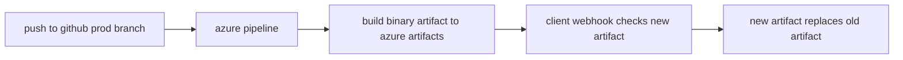

# Open-Monitor Deployment Models

## Client-Monitor (Host-Process)
The client monitor controls the monitoring of the host system, as well as transmitting said data to the host monitor. 

Note, our deployment process is representive of our usage being our host machines all running ubuntu. 

### Current CI/CD Process

Initialization of this process first requires that webhook script is uploaded & executed on the host machine in addition with the scripts configuration file (this can be found in `scripts/initialization`). This configuration file should represent where to search for new artifact in addition to the address of the "host monitoring service". After script execution, this process should automatically detect artifact changes and update the binary to most recent. 

## Host-Monitor
The host monitor controls the overall injestion/ relay of data from serveral host processes concurrently and stores them in elasticsearch. The host monitor also handles the web socket grpc bridging for the live service connections. 

### Current CI/CD Process
__TBD__:
